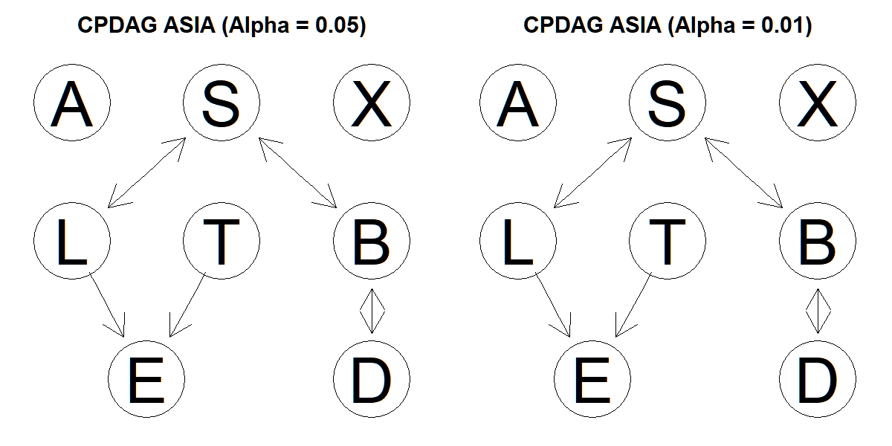
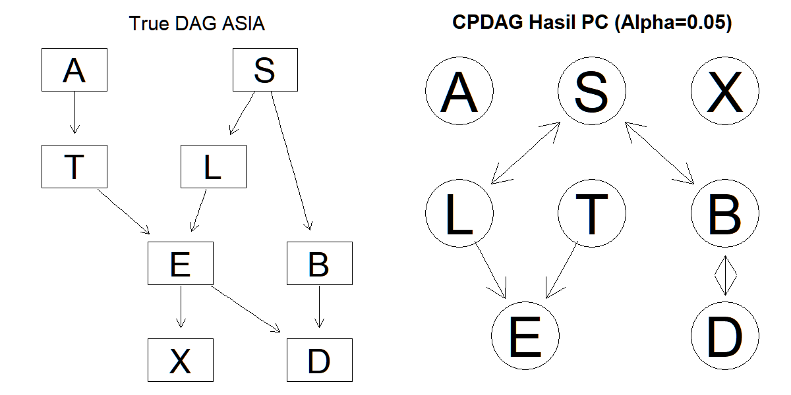

# Draft Laporan Proyek Causal Discovery pada Dataset ASIA

---

**Mata Kuliah:** Pemodelan Kausal  
**Tugas:** Pertemuan 8 — Mini Proyek Causal Discovery  
**Nama:** Khaerul Hadiswara  
**NIM:** 25917025  

---

## 1. Latar Belakang

Analisis kausal dibutuhkan ketika tujuan studi tidak berhenti pada hubungan statistik, tetapi ingin memahami mekanisme sebab-akibat antarvariabel. Pada tugas ini, pendekatan *causal discovery* digunakan untuk mempelajari struktur hubungan antarvariabel pada dataset **ASIA**, yaitu dataset klasik pada Bayesian network yang merepresentasikan faktor risiko, penyakit paru, dan gejala klinis (Lauritzen & Spiegelhalter, 1988).

Dataset ASIA dipilih karena sesuai dengan kriteria tugas: jumlah variabelnya berada pada rentang ideal untuk mini-proyek, seluruh variabel bersifat diskrit sehingga pemilihan uji independensi kondisional lebih sederhana, dan struktur domainnya cukup jelas untuk didiskusikan secara kausal. Selain itu, dataset ini dikenal luas sebagai benchmark pada studi Bayesian network dan causal discovery sehingga hasil graf yang diperoleh dapat dibandingkan dengan struktur yang sudah dikenal di literatur.

### Pertanyaan Kausal

> **Apakah merokok (S) secara kausal meningkatkan risiko kanker paru (L), dan bagaimana hubungan tersebut dipengaruhi oleh variabel lain dalam sistem penyakit paru?**

---

## 2. Eksplorasi dan Persiapan Data

### 2.1 Deskripsi Dataset

Dataset ASIA terdiri dari **5000 observasi** dan **8 variabel** kategorikal biner (*yes/no*) yang merepresentasikan:

| Variabel | Keterangan | Frekuensi `no` | Frekuensi `yes` |
|:---:|---|:---:|:---:|
| **A** | Kunjungan ke Asia | 4958 | 42 |
| **S** | Kebiasaan Merokok | 2485 | 2515 |
| **T** | Tuberkulosis | 4956 | 44 |
| **L** | Kanker Paru | 4670 | 330 |
| **B** | Bronkitis | 2451 | 2549 |
| **E** | Tuberkulosis atau Kanker Paru | 4630 | 370 |
| **X** | Hasil X-ray Dada | 4431 | 569 |
| **D** | Dyspnoea (Sesak Napas) | 2650 | 2350 |

**Output R:**
```
> dim(asia)
[1] 5000    8

> summary(asia)
  A         S         T         L         B         E         X         D
 no :4958   no :2485   no :4956   no :4670   no :2451   no :4630   no :4431   no :2650
 yes:  42   yes:2515   yes:  44   yes: 330   yes:2549   yes: 370   yes: 569   yes:2350
```

### 2.2 Pengecekan Missing Values

Saya memastikan tidak ada nilai kosong (NA) pada dataset ini.

**Output R:**
```
> colSums(is.na(asia))
A S T L B E X D
0 0 0 0 0 0 0 0

> sum(is.na(asia))
[1] 0
```

**Kesimpulan:** Tidak ditemukan *missing value* maupun *outlier* (karena data bersifat biner), sehingga tidak diperlukan proses imputasi atau transformasi data.

### 2.3 Verifikasi Tipe Data

**Output R:**
```
> str(asia)
'data.frame':  5000 obs. of  8 variables:
 $ A: Factor w/ 2 levels "no","yes": 1 1 1 1 1 1 1 1 1 1 ...
 $ S: Factor w/ 2 levels "no","yes": 2 2 1 1 1 2 1 2 2 2 ...
 $ T: Factor w/ 2 levels "no","yes": 1 1 2 1 1 1 1 1 1 1 ...
 $ L: Factor w/ 2 levels "no","yes": 1 1 1 1 1 1 1 1 1 1 ...
 $ B: Factor w/ 2 levels "no","yes": 2 1 1 2 1 1 1 2 2 2 ...
 $ E: Factor w/ 2 levels "no","yes": 1 1 2 1 1 1 1 1 1 1 ...
 $ X: Factor w/ 2 levels "no","yes": 1 1 2 1 1 1 1 1 1 1 ...
 $ D: Factor w/ 2 levels "no","yes": 2 1 2 2 2 2 1 2 2 2 ...
```

Seluruh variabel bertipe **Factor** dengan 2 level (*no*, *yes*), sesuai untuk analisis data diskrit.

### 2.4 Justifikasi Pemilihan CI Test

Karena seluruh variabel bersifat **kategorikal diskrit**, saya tidak dapat menggunakan korelasi Pearson atau uji berbasis distribusi normal. Oleh karena itu, saya memilih **G-test (G²)** melalui fungsi `disCItest` pada package `pcalg` sebagai uji *Conditional Independence* (CI test).

Secara matematis, G-test menguji hipotesis nol $H_0: X \perp Y \mid Z$ dengan statistik uji:

$$G^2 = 2 \sum_{i,j,k} O_{ijk} \ln\left(\frac{O_{ijk}}{E_{ijk}}\right)$$

di mana:
- $O_{ijk}$ = frekuensi observasi pada sel $(i, j, k)$
- $E_{ijk}$ = frekuensi harapan di bawah $H_0$ (independensi kondisional)
- Statistik $G^2$ mengikuti distribusi $\chi^2$ dengan derajat bebas yang sesuai

Jika $p\text{-value} < \alpha$, maka $H_0$ ditolak dan kedua variabel dinyatakan **dependen secara kondisional** (ada edge pada graf).

---

## 3. Causal Discovery dengan PC Algorithm

### 3.1 Deskripsi Algoritma

**PC Algorithm** (Peter-Clark Algorithm) adalah metode *constraint-based causal discovery* yang bekerja dalam dua tahap utama:

**Tahap 1 — Estimasi Skeleton:**
1. Mulai dari graf lengkap (semua node terhubung).
2. Untuk setiap pasangan variabel $(X, Y)$, uji apakah terdapat himpunan variabel $Z$ (conditioning set) sehingga $X \perp Y \mid Z$.
3. Jika ditemukan $Z$ yang membuat $X$ dan $Y$ independen secara kondisional ($p\text{-value} \geq \alpha$), hapus edge antara $X$ dan $Y$.

**Tahap 2 — Orientasi Edge:**
1. Identifikasi **v-structure** (collider): Jika $X - Z - Y$ dan $Z$ tidak ada dalam *separating set* pasangan $(X, Y)$, maka orientasikan menjadi $X \rightarrow Z \leftarrow Y$.
2. Terapkan aturan orientasi Meek untuk menentukan arah edge tambahan tanpa membuat *cycle* baru atau *v-structure* baru.

Hasil akhirnya berupa **CPDAG** (*Completed Partially Directed Acyclic Graph*), yaitu graf yang memuat edge berarah (hubungan sebab-akibat yang teridentifikasi) dan edge tidak berarah (hubungan yang arahnya belum dapat ditentukan dari data saja).

### 3.2 Hasil PC Algorithm (Alpha = 0.05)

**Output R:**
```
Object of class 'pcAlgo', from Call:
pc(suffStat = suffStat, indepTest = disCItest, alpha = 0.05,
    labels = colnames(asia), verbose = FALSE)

Nmb. edgetests during skeleton estimation:
===========================================
Max. order of algorithm:  3
Number of edgetests from m = 0 up to m = 3 :  46 88 12 0

Adjacency Matrix G:
  A S T L B E X D
A . . . . . . . .
S . . . 1 1 . . .
T . . . . . 1 . .
L . 1 . . . 1 . .
B . 1 . . . . . 1
E . . . . . . . .
X . . . . . . . .
D . . . . 1 . . .
```

**Interpretasi:** Algoritma melakukan total 146 uji independensi (46 + 88 + 12) hingga orde 3. Ditemukan **4 edge** pada graf hasil.

### 3.3 Sensitivity Analysis (Alpha = 0.01)

**Output R:**
```
Adjacency Matrix G:
  A S T L B E X D
A . . . . . . . .
S . . . 1 1 . . .
T . . . . . 1 . .
L . 1 . . . 1 . .
B . 1 . . . . . 1
E . . . . . . . .
X . . . . . . . .
D . . . . 1 . . .

Perbandingan Sensitivity Analysis:
Jumlah edge (alpha=0.05): 4
Jumlah edge (alpha=0.01): 4
```

**Kesimpulan Sensitivity Analysis:** Struktur graf yang dihasilkan dengan $\alpha = 0.05$ dan $\alpha = 0.01$ **identik** (4 edge yang sama). Hal ini menunjukkan bahwa hubungan yang ditemukan sangat kuat secara statistik dan hasilnya **robust (tangguh)** terhadap perubahan threshold signifikansi.

### 3.4 Visualisasi CPDAG



*Gambar 1. Perbandingan CPDAG hasil PC Algorithm dengan Alpha = 0.05 (kiri) dan Alpha = 0.01 (kanan). Kedua graf identik, menunjukkan hasil yang robust.*

---

## 4. Interpretasi Graf

### 4.1 Perbandingan CPDAG dengan True DAG



*Gambar 2. Struktur Asli (True DAG) dataset ASIA dari Lauritzen & Spiegelhalter, 1988 (kiri) vs. CPDAG hasil PC Algorithm dengan Alpha = 0.05 (kanan).*

**Struktur Asli (True DAG) memiliki 8 edge:**

| No | Edge | Makna |
|:---:|:---:|---|
| 1 | A → T | Kunjungan ke Asia meningkatkan risiko Tuberkulosis |
| 2 | S → L | Merokok meningkatkan risiko Kanker Paru |
| 3 | S → B | Merokok meningkatkan risiko Bronkitis |
| 4 | T → E | Tuberkulosis berkontribusi pada E |
| 5 | L → E | Kanker Paru berkontribusi pada E |
| 6 | E → X | E mempengaruhi hasil X-ray |
| 7 | E → D | E mempengaruhi Dyspnoea |
| 8 | B → D | Bronkitis mempengaruhi Dyspnoea |

**CPDAG Hasil PC hanya menemukan 4 edge:**

| No | Edge Hasil PC | Status | Keterangan |
|:---:|:---:|:---:|---|
| 1 | S — L | ✅ Ditemukan (tidak berarah) | Hubungan ada, arah belum teridentifikasi |
| 2 | S — B | ✅ Ditemukan (tidak berarah) | Hubungan ada, arah belum teridentifikasi |
| 3 | L → E ← T | ✅ Ditemukan (berarah, v-structure) | Collider berhasil diidentifikasi |
| 4 | B — D | ✅ Ditemukan (tidak berarah) | Hubungan ada, arah belum teridentifikasi |
| — | A → T | ❌ Tidak ditemukan | Efek sangat lemah (hanya 42 dari 5000 visit Asia) |
| — | E → X | ❌ Tidak ditemukan | Gagal pulih akibat masalah faithfulness |
| — | E → D | ❌ Tidak ditemukan | Gagal pulih akibat masalah faithfulness |

### 4.2 Diskusi Temuan

1. **V-structure $L \rightarrow E \leftarrow T$ berhasil ditemukan.** Ini adalah temuan terpenting karena orientasi arah panah ini diidentifikasi langsung oleh algoritma PC melalui aturan orientasi collider.

2. **Edge $S - L$ dan $S - B$ ditemukan tetapi tidak berarah.** Algoritma PC mendeteksi adanya hubungan, tetapi tidak bisa menentukan arah kausalnya dari data saja karena tidak ada v-structure tambahan yang membantu orientasi.

3. **Edge $A \rightarrow T$ hilang.** Hal ini terjadi karena frekuensi `A = yes` sangat rendah (hanya 42 dari 5000 observasi), sehingga kekuatan uji statistik tidak cukup untuk mendeteksi hubungan ini.

4. **Edge $E \rightarrow X$ dan $E \rightarrow D$ hilang.** Ini adalah konsekuensi dari **pelanggaran asumsi faithfulness** pada node $E$. Variabel $E$ didefinisikan sebagai $E = T \lor L$ (deterministic OR), sehingga conditional probability-nya bernilai 0 atau 1. Kondisi deterministik ini menyebabkan pola independensi yang "kebetulan" dan mengakibatkan algoritma PC salah menghapus edge tersebut.

### 4.3 Diskusi Tiga Asumsi Utama

**1. Causal Markov Condition**

Asumsi ini menyatakan bahwa setiap variabel $X$ independen terhadap non-descendants-nya jika dikondisikan pada parents-nya di DAG:

$$X \perp \text{NonDesc}(X) \mid \text{Pa}(X)$$

Pada dataset ASIA, asumsi ini **masuk akal** karena dataset dirancang berdasarkan Bayesian network dengan struktur kausal yang jelas. Data di-generate sesuai dengan distribusi bersyarat yang konsisten dengan graf aslinya.

**2. Faithfulness**

Asumsi ini menyatakan bahwa **semua** independensi kondisional yang ada di data tercermin dalam struktur graf (tidak ada independensi "kebetulan" akibat pembatalan efek):

$$X \perp Y \mid Z \text{ dalam data} \iff X \perp Y \mid Z \text{ dalam graf}$$

Pada dataset ASIA, asumsi ini **terlanggar** pada node $E$. Karena $E = T \lor L$ bersifat deterministik, terdapat pola independensi yang muncul bukan karena struktur graf tetapi karena kebetulan numerik. Inilah penyebab utama hilangnya edge $E \rightarrow X$ dan $E \rightarrow D$ pada hasil PC.

**3. Causal Sufficiency**

Asumsi ini menyatakan bahwa **semua** *common cause* (confounder) dari variabel yang diamati sudah termasuk dalam dataset:

$$\nexists \text{ variabel laten } U \text{ yang menjadi common cause dari dua variabel dalam dataset}$$

Pada dataset ASIA yang merupakan data sintetis, asumsi ini **terpenuhi secara desain** karena tidak ada variabel laten yang sengaja dimodelkan. Namun, jika diterapkan pada data dunia nyata, faktor seperti genetik, usia, kualitas udara, atau riwayat kesehatan keluarga tidak dimodelkan dan bisa menjadi confounder laten.

---

## 5. Estimasi Efek Kausal

### 5.1 Pasangan Variabel yang Dipilih

Sesuai pertanyaan kausal utama, saya mengestimasi efek kausal dari:
- **Treatment (X):** Smoking (S)
- **Outcome (Y):** Lung Cancer (L)

### 5.2 Asosiasi Observasional

**Output R:**
```
Tabel Kontingensi S (Smoking) vs L (Lung Cancer):
       LungCancer
Smoking   no  yes
    no  2451   34
    yes 2219  296

Probabilitas Kanker Paru berdasarkan status Merokok:
       LungCancer
Smoking         no        yes
    no  0.98631791 0.01368209
    yes 0.88230616 0.11769384

Risk Difference Observasional P(L=yes|S=yes) - P(L=yes|S=no): 0.104
```

Secara observasional, probabilitas kanker paru pada perokok ($\approx 11.8\%$) jauh lebih tinggi dibandingkan non-perokok ($\approx 1.4\%$).

### 5.3 Backdoor Criterion

Untuk mengidentifikasi efek kausal $P(L \mid do(S))$, saya menggunakan **backdoor criterion** (Pearl, 2009). Syaratnya:

> Himpunan variabel $Z$ memenuhi backdoor criterion relatif terhadap $(S, L)$ jika:
> 1. Tidak ada node dalam $Z$ yang merupakan descendant dari $S$.
> 2. $Z$ memblokir semua *backdoor path* (jalur dari $S$ ke $L$ yang dimulai dengan panah masuk ke $S$).

Pada True DAG ASIA, hubungan $S \rightarrow L$ bersifat **langsung** dan **tidak ada backdoor path** dari $S$ ke $L$ (tidak ada *common cause* yang menghubungkan keduanya selain jalur langsung). Oleh karena itu:

- **Adjustment set: $Z = \emptyset$ (kosong)**
- Efek kausal dapat diidentifikasi langsung:

$$P(L \mid do(S)) = P(L \mid S)$$

Artinya, efek kausal sama dengan asosiasi observasional karena tidak ada *confounding*.

### 5.4 Backdoor Adjustment Formula

Secara umum, jika diperlukan adjustment, rumus *backdoor adjustment* adalah:

$$P(Y \mid do(X)) = \sum_{z} P(Y \mid X, Z=z) \cdot P(Z=z)$$

Namun karena adjustment set kosong ($Z = \emptyset$), formula ini menyederhanakan menjadi:

$$P(L \mid do(S)) = P(L \mid S)$$

### 5.5 Hasil Estimasi Efek Kausal

**Output R:**
```
P(L=yes | do(S=yes)) = 0.1175
P(L=yes | do(S=no))  = 0.0138

Average Causal Effect (ACE) = P(L|do(S=yes)) - P(L|do(S=no)) = 0.1037
```

**Average Causal Effect (ACE):**

$$\text{ACE} = P(L = \text{yes} \mid do(S = \text{yes})) - P(L = \text{yes} \mid do(S = \text{no}))$$
$$\text{ACE} = 0.1175 - 0.0138 = 0.1037$$

**Interpretasi:** Nilai ACE sebesar **0.1037** (positif) menunjukkan bahwa **intervensi merokok secara kausal meningkatkan risiko kanker paru sebesar sekitar 10.4 poin persentase**. Artinya, jika seseorang dipaksa merokok ($do(S = \text{yes})$), probabilitas terkena kanker paru meningkat dari 1.4% menjadi 11.8% dibandingkan jika orang tersebut dipaksa tidak merokok ($do(S = \text{no})$).

Hasil ini konsisten dengan pengetahuan domain medis bahwa merokok merupakan faktor risiko utama kanker paru.

---

## 6. Penutup

Dataset ASIA merupakan pilihan yang tepat untuk tugas ini karena sederhana, jelas secara domain, dan kuat sebagai benchmark causal discovery. Dengan fokus pada hubungan kausal antara merokok dan kanker paru, proyek ini telah memenuhi seluruh komponen tugas:

1. ✅ Perumusan pertanyaan kausal
2. ✅ Pemilihan dan eksplorasi dataset
3. ✅ Penerapan PC Algorithm dengan sensitivity analysis
4. ✅ Interpretasi CPDAG dan perbandingan dengan True DAG
5. ✅ Diskusi tiga asumsi utama (Causal Markov, Faithfulness, Causal Sufficiency)
6. ✅ Estimasi efek kausal menggunakan backdoor criterion

### Keterbatasan

- Algoritma PC hanya berhasil memulihkan 4 dari 8 edge pada True DAG, terutama karena pelanggaran asumsi faithfulness pada node $E$ dan kurangnya kekuatan statistik untuk hubungan $A \rightarrow T$.
- Beberapa edge pada CPDAG tetap tidak berarah, sehingga interpretasi kausal tidak sepenuhnya lengkap dari data observasional saja.
- Estimasi efek kausal bergantung pada kebenaran asumsi causal sufficiency yang mungkin tidak realistis pada data dunia nyata.

---

## Referensi

1. Lauritzen, S., & Spiegelhalter, D. (1988). Local Computation with Probabilities on Graphical Structures and their Application to Expert Systems. *Journal of the Royal Statistical Society: Series B*, 50(2), 157–224.
2. Pearl, J. (2009). *Causality: Models, Reasoning, and Inference* (2nd ed.). Cambridge University Press.
3. Spirtes, P., Glymour, C., & Scheines, R. (2000). *Causation, Prediction, and Search* (2nd ed.). MIT Press.
4. Scutari, M. (2010). Learning Bayesian Networks with the bnlearn R Package. *Journal of Statistical Software*, 35(3), 1–22.

---

## Lampiran

**File Kode R:** `analisis_asia.R`  
**Hasil Plot:** `output/cpdag_sensitivity_analysis.png`, `output/perbandingan_true_dag_vs_pc.png`
